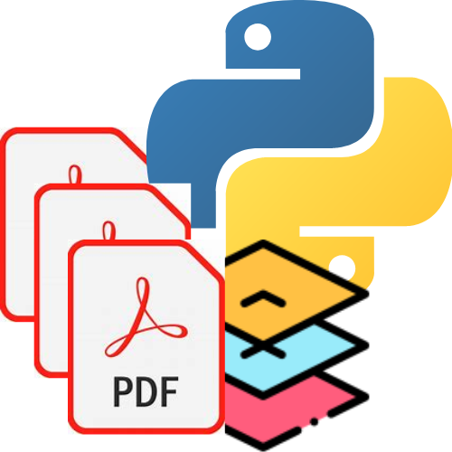

<p align="center">
  
</p>

# Python-PDF-Editor

Welcome to the Python-PDF-Editor repository! This project is a simple yet functional PDF editor created with Python. It's currently a work in progress, but it already includes some handy features for editing PDF files.

## Features
- **Edit PDF Text**: Modify the text in your PDF files.
- **Merge PDFs**: Combine multiple PDF files into one.
- **Split PDFs**: Separate one PDF into multiple documents.
- **Rotate Pages**: Change the orientation of pages within a PDF.

## Installation
To get started with Python-PDF-Editor, clone this repository and install the required dependencies:
```bash
git clone https://github.com/YashGames2007/Python-PDF-Editor.git
cd Python-PDF-Editor
pip install -r requirements.txt
```

## Usage
Run the main script from the command line to start editing your PDFs:
```bash
python src/pdfviewer_advanced.py
```

## Contributing
Contributions are welcome! If you have any ideas or suggestions, feel free to open an issue or submit a pull request.

## License
This project is licensed under the MIT License - see the [LICENSE](LICENSE) file for details.

## Acknowledgments
- Thanks to all the contributors who have helped with this project.
- Special thanks to [Yash Bhavsar](https://github.com/YashGames2007), for initiating and maintaining this repository.
- Also thanks to [Anand Pathade](https://github.com/MrMystery-AP) to Collaborate and make some important changes to repository.

Happy Editing!
